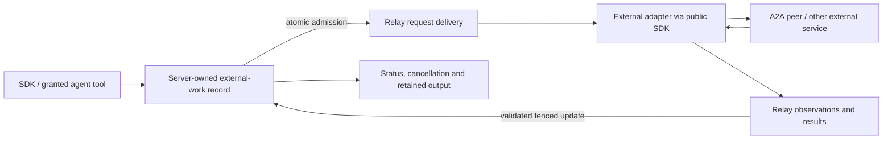

# Relay delivery for external work and A2A identity mapping

Status: architecture direction agreed; implementation planned. Recorded on
2026-10-09 after the user requested one outbound mechanism, explicit correlation
and conversation mappings, a design document and planning tickets. This document
describes the target and implementation gates; it does not claim the migration
or additional A2A capabilities have shipped.

The inspected source snapshot is `35ffa6e06578576e5af19728b08658b22384801c`.
Implementation must recheck current main and reconcile changes before proceeding.

## Problem and decision

Plowshare has a durable Relay broker with public SDK topic ports, external tool
request/result delivery and internal dispatch reconciliation. Outgoing work also
has a separate queue, adapter claims and reports. A2A, Home Assistant and future
external capabilities should share Relay delivery rather than each acquiring
another queue or execution mechanism.

Use Relay for outbound requests, cancellation requests, observations and results.
Keep a server-owned external-work record for task identity, lifecycle, remote
bindings and retained output. That record outlives broker history and is the
authority for recovery. Delivery acknowledgement, remote acceptance and task
completion remain distinct events.

Adapters remain external public-SDK consumers. They own protocol translation,
external connections and credentials; they do not import server services or
create a second durable agent runtime. Common platform changes belong in the
platform tickets under [the integration boundary](0001-integration-boundary.md),
separately from adapter implementation. This request authorizes documenting and
ticketing that work; it does not deploy or implement it.

## Existing behavior and capabilities to preserve

- A2A ingress uses `IncomingClient` and `incoming.receive/status/cancel/catalog`.
  One accepted incoming message has one retained task receipt. Its external
  context resolves to a passive sender and persistent receiving instance, whose
  conversation provides continuity across tasks.
- Outgoing work retains a submission UUID, receipt, project, optional local
  conversation, peer, remote task/context, state, result and revision. An initial
  claim commits `DISPATCHED` before external I/O. A claim without a known remote
  task is not automatically taken over to resend. Known remote tasks can resume
  observation or cancellation after the claim lease expires.
- Public Relay ports support configured project ingress/egress, competing
  consumers within a group, independent group cursors and fenced whole-batch
  acknowledgements. Consumption does not advance the cursor. An acknowledgement
  is neither a content verdict nor proof of external completion.
- Internal Relay delivery already has admission, claims, dispatch intent,
  acceptance and uncertain-effect reconciliation. These internal interfaces are
  implementation reuse opportunities, not APIs adapters may call directly.
- Relay tool invocations demonstrate atomic owning-record/publication admission
  and retained results above broker retention. Reuse that pattern; audit current
  public contracts before selecting an implementation.
- The A2A receiver emits replies through task history and `status.message`, but
  currently emits no artifacts. The outgoing A2A client already retains typed
  remote task/message observations, including artifacts supplied by the peer.

## Target ownership and delivery

`OutgoingClient` and existing agent-facing outgoing tools should remain convenient
facades where compatibility permits. Their backend uses the common broker and
owning lifecycle record; there is no competing legacy queue after cutover. A2A's
HTTP interface remains external protocol translation, independently of internal
Relay delivery.

Use bounded, versioned envelopes carrying an operation kind, work identity,
correlation, binding identity and references to retained inputs or outputs.
Convert application JSON at approved boundaries to validated typed DTOs before
business logic. Do not place generic maps or raw JSON into domain contracts.

Relay TEXT defaults to 5 MiB of raw UTF-8 text, configurable up to 50 MiB, with a separate encoded-payload
allowance for worst-case JSON escaping, carried by
[segmented SDK transport](0009-segmented-sdk-message-transport.md): small transport
packets are assembled before normal decoding and one logical Relay publication.
Packet size, encoded-message allowance, raw text limit, database policy and batch
byte paging are separate bounds. The transport and size extension are implemented separately; the external-work
migration in this decision remains planned.
Existing outgoing messages allow 256 KiB and results allow 1 MiB; preserve those
contracts through the platform extension rather than silently shrinking them.
Retained owning work and references remain necessary for lifecycle, recovery and
output that outlives broker retention. Define any missing reference-read capability
as a general platform gap before adapter changes.

## Identity and correlation contract

Identities have separate roles even when an existing facade deliberately derives
one identity from another. Retain their relationships rather than reconstructing
them from timestamps, string prefixes or the current process's memory.

| Identity | Mapping and invariant |
| --- | --- |
| Receiving A2A `contextId` | Maps through a retained external-context record to a persistent receiving instance and its Plowshare conversation ID. The wire UUID and conversation ID remain distinct. |
| Receiving A2A task `id` | Maps to a durable incoming task receipt, accepted message and delivery outcome. It is not a conversation, job or run ID. |
| Incoming A2A `messageId` | Derives the SDK receive request UUID using configured project, agent and authenticated client alias. Same identity and unchanged work recover the existing receipt; changed work is refused. |
| Outgoing `requestId` | Identifies one idempotent local submission. It exists before any remote task is assigned. |
| Outgoing receipt `id` | Owns the local external-work lifecycle. The current A2A adapter uses this UUID as the outbound wire `messageId`; migration preserves that relationship for existing work. |
| Remote A2A task/context | Bind to the local receipt under an authenticated configured peer/binding scope. The same opaque ID from two peers does not name the same resource. Once bound, a conflicting remote identity is refused. |
| Optional local outgoing conversation ID | Attributes the submission to an existing authorized conversation. It does not automatically select the remote context. |
| Relay `correlationId` | For a newly submitted external task, use the stable local receipt UUID as the task-level correlation value. Persist it before publication. Request, observation, cancellation and result envelopes carry it unchanged. Legacy work retains its established identities and receives an explicit mapping. |
| Relay publication request/event identity | Identifies one publication, not the whole task. Distinct logical commands and observations get distinct stable publication UUIDs; an exact retry uses its retained UUID and content. |
| Relay causal parent/root | Preserves why an event occurred and the remaining effect budget. Correlation alone does not establish ancestry or permit a new effect. |
| Relay batch token/fence | Authorizes acknowledgement of one delivered batch; it is not a task ID or perpetual execution lease. |
| Work claim/revision | Fences updates and external dispatch independently of the transport acknowledgement. A stale worker cannot report or initiate another effect. |
| Final reply/artifact identity | A retained final reply maps deterministically to a task-local artifact ID. Polling and adapter restart return the same artifact identity and content. |
| JSON-RPC `id` | Correlates one HTTP request/response exchange, independently of durable work identities. |

The receiving context scope is the authenticated execution principal, configured
project, receiving agent and authenticated external client alias. The server
already retains this mapping. Document and test it; do not replace it with a new
adapter-local conversation database. Same-context messages use the existing serial
message scheduling of that persistent instance.

Outgoing references additionally bind the selected peer and configuration
identity. Different tasks may share one conversational context, so the context
cannot serve as their sole correlation or deduplication key. An A2A task may span
multiple local execution stages; never equate it with one job or run. Incoming
receipt-to-message relationships remain distinct from outgoing receipt-to-remote
task relationships.

Authentication determines ownership. Service tokens execute as
`@service/<token UUID>` while grants use the owning service account and token
scope. Rotation preserves that principal; issuing another token changes it.
Client aliases and peer bindings are authenticated/configured identities, not
caller-selected authority. A path such as `/application/account/taskid` neither
establishes ownership nor substitutes for stored relationships and permission
checks. A2A context is a conversational session, not an authentication principal;
see [A2A 1.0 context semantics](https://a2a-protocol.org/v1.0.0/specification/#341-context-identifier-semantics).

## Admission, acknowledgement and failure recovery

1. Validate caller authority, peer/binding, request identity and payload. Commit
   the work receipt, correlation mapping and first Relay publication atomically.
   Repeated identical submissions return the same receipt; a rollback publishes
   no request.
2. Consume through authorized Relay ports. Before acknowledgement, durably admit
   each item to its owning work lifecycle. Whole-batch acknowledgement requires
   durable disposition of every item, not merely the first successful handler.
   An expired transport token cannot authorize a stale acknowledgement.
3. Commit fenced dispatch intent before external I/O. Redelivery resolves the
   existing admission/receipt. It cannot invoke the initial external send again
   after dispatch intent exists. Do not rely solely on the consumer lease or a
   peer's optional message deduplication to prevent duplicate effects.
4. Validate observations against work identity, correlation, peer/binding,
   authenticated publisher, current authority, claim generation and revision.
   Persist remote identities and output through the owning repository. Broker
   acknowledgement alone cannot mark the task complete.
5. If a send may have happened but its outcome is unknown, retain uncertainty.
   Recovery uses authorized read-only evidence; it never infers non-delivery from
   an absent event, expired lease, timeout or missing local process.
6. If the remote task is known, a fenced successor may resume observation or
   request cancellation. A cancellation request is not proof that the remote
   effect stopped. Record confirmed cancellation and reject incompatible late
   observations according to the owning lifecycle.

Broker expiry does not erase external-work evidence or authorize another send.
Retention gaps require an inspected recovery decision. Any republishing of known
undispatched work must prove no dispatch intent/effect exists, preserve its work
identity and never manufacture a fresh task.

Current derived SDK publication requires the parent event to remain retained.
Long-lived external tasks can outlive that parent. The platform design slice must
choose a bounded retention/reconciliation contract or a typed path using retained
owning-record ancestry. Until then, report the capability gap. Never reset a
result or cancellation chain to a new root merely to bypass expiry or hop limits.

## A2A output and lifecycle profile

The first completion target is a reliable text-based polling profile, not full
A2A coverage. Return the same task and context identities on `SendMessage` and
`GetTask`, including after restart. Return final successful text as an artifact
with stable `artifactId`, `parts` and `text/plain` media type. Artifacts must remain
available with `historyLength: 0`; history is communication, not the only storage
of a deliverable. A2A artifacts are optional under the specification; adding this
mapping improves deliverable interoperability rather than correcting every
reply-only response into mandatory artifacts. See [A2A artifacts](https://a2a-protocol.org/v1.0.0/specification/#417-artifact).

Use the retained final-reply flag rather than assuming the newest message is the
final answer. Keep intermediate replies in history/status and failure diagnostics
separate from successful artifacts. The server already retains an explicit final
reply or generates one from the handling outcome. Define empty-output behavior
explicitly so a generated "no text" diagnostic is not presented as a useful
successful deliverable. Preserve actual endings and output provenance.

Keep the existing state translation: queued to submitted, handling to working,
approval wait to input-required, answered to completed, other unsuccessful endings
to failed, and confirmed cancellation/deadline expiry to canceled. A2A task
completion does not close its persistent conversation. Remote output is untrusted
data, not an instruction or proof of local tool execution.

Current ingress refuses task follow-ups, including approval continuation through
A2A text. Operator approval remains the authority. Full task continuation,
structured/file ingress and output, streaming, subscriptions and push notification
support are later scoped extensions with exact public capability gaps. Preserve
typed remote artifacts already accepted by outbound result contracts; never
silently discard them when adapting the delivery mechanism.

## Compatibility and cutover

Inventory existing clients, generic outgoing peers, A2A and Home Assistant before
choosing changed shared contracts. Keep request/receipt IDs, remote bindings,
terminal results, cancellation intent, ownership and uncertainty through migration.
Use new Flyway migrations for necessary persistence changes; never edit a shipped
migration or allocate a version without checking current main.

Choose an explicit per-binding cutover. Old and Relay dispatchers must never
compete to execute the same work. Define how queued, dispatched-without-remote-ID,
known-remote-task, terminal and unknown records transition. Rollback must preserve
the owning records and prevent an old dispatcher from resending a task already
admitted through Relay. No deleting evidence to recover a stuck task.

SDK APIs can stay facades while their server implementation changes. Any necessary
operation/schema changes must update all affected SDKs, clients, generated catalogs
and conformance fixtures together, with explicit compatibility behavior. Keep
deployment credentials, endpoints and private adapter journals out of public code
and the document.

## Ordered implementation slices

| Slice | Deliverable | Dependencies |
| --- | --- | --- |
| EW01 | Audit current contracts and finalize the general Relay external-work contract, payload references, ancestry and authorization decisions | None |
| EW02 | Retain and propagate identity/correlation mappings and authorized recovery reads | EW01 |
| EW03 | Implement atomic Relay admission, fenced external dispatch, observation and cancellation delivery | EW01, EW02 |
| EW04 | Migrate existing work and define mutually exclusive cutover/rollback with compatible facades | EW02, EW03 |
| EW05 | Update SDK integration runtime, A2A and Home Assistant to the common public delivery path | EW03, EW04 |
| EW06 | Produce stable A2A text artifacts and verify task/conversation/state mappings | EW01, EW02; receiving output work can proceed independently of outbound cutover |
| EW07 | Verify cross-boundary behavior, failure windows and independent A2A interoperability | EW04, EW05, EW06 |
| EW08 | Publish current manuals, examples, migration/recovery guidance and supported-capability declarations | EW07 |

The separate segmented-transport platform ticket gates the larger-payload path
for EW03/EW05. EW01 must finalize that capability boundary. EW06's receiving
artifact and identity work can proceed independently; packets do not change the
A2A context, task, receipt or Relay correlation mapping.

The epic tracks the common platform outcome. Adapter tickets cannot conceal a
missing platform capability by importing core. Existing Relay provenance, AHP,
Discord and outbound MCP planning should link to this common work where applicable
without being rewritten as completed or silently expanding their protocol scope.

## Acceptance and verification

Use mocked repositories and focused adapter HTTP/SDK tests by default. Necessary
SQL atomic admission, uniqueness, row mapping, locking and migration assertions
justify the smallest explicitly tagged `-PfullDb` test set during implementation.
This documentation task runs no database tests.

Acceptance must demonstrate:

- Exact submission recovery, conflict refusal and stable identity mappings through
  restart; multiple tasks in one context share a conversation without sharing task
  correlation. Reused opaque IDs across peers remain isolated.
- Live caller/provider authorization, service-token ownership, cross-client refusal,
  rotation continuity, revoked grants and stale-fence/report refusal.
- Crash before admission, after admission before ack, after ack before dispatch,
  after dispatch intent and after remote acceptance before observation persistence;
  lost WS responses, whole-batch redelivery, competing consumers and broker gaps.
- No repeated external mutation from uncertainty, retention loss or cutover, and
  read-only recovery for known remote tasks across worker takeover.
- Final text artifact survives history omission, adapter restart and repeated polling;
  failures/cancellation produce accurate states and provenance, and remote artifacts
  remain intact. An independent A2A client verifies the actual response shape.
- Compatibility across affected SDKs/clients, generated contract checks, required
  formatting and relevant repository checks. Runtime and adapter changes are
  verified through public boundaries with separately configured process origins.

See [receiving mappings](../a2a-receiving.md#context-conversation-and-task-mapping),
[outgoing recovery](../a2a-sending.md), [Relay ports](../relay.md),
[Relay tools](../relay-tools.md) and [Application-owned tools](0006-application-scoped-live-tools.md).
