# Segmented SDK message transport

Status: implemented in this change, recorded on 2026-10-09; configurable TEXT admission added on 2026-10-10. This is general
platform work, separate from A2A adapter work under
[the integration boundary](0001-integration-boundary.md). Deployment and the
remaining [Relay external-work migration](0008-relay-external-work-and-a2a-mapping.md)
are separate work.

## Decision

Serialize the ordinary SDK message once, nest its UTF-8 bytes inside bounded
transport packets, and reassemble the complete message before ordinary decoding,
validation, authorization and dispatch. Requests, responses and pushes use the
same mechanism. Relay receives one logical publication with its existing
publication identity, correlation, ordering and acknowledgement semantics.

```mermaid
flowchart LR
    S["Typed request / response / push"] --> E["Encode ordinary JSON to UTF-8"]
    E --> P["Packets: 1 of N, offset, total bytes, hash"]
    P --> W["Small WebSocket messages"]
    W --> A["Connection-owned bounded assembly"]
    A --> H["Verify complete hash and UTF-8"]
    H --> D["Normal typed decode and authorization"]
    D --> R["One logical operation"]
```



Packets are transport objects, not individual Relay events. They do not advance
a consumer cursor, acquire work ownership or establish causal ancestry.
WebSocket fragmentation alone is insufficient: Spring receives an assembled
WebSocket text message. Each packet is its own bounded WebSocket message.

The byte-range and integrity principles follow
[FileSource](../../plowshare-protocol/src/main/java/io/aeyer/plowshare/protocol/FileSource.java):
64 KiB ranges, offsets, Base64 and a whole-content SHA-256. FileSource retains
its separate file-provider pull contract and 8 MiB content bound.

## Negotiation and compatibility

The authenticated `/v1/events` WebSocket upgrade selects the exact subprotocol
`plowshare-segments-v1`. This selects fixed version-one bounds; there is no
application bootstrap operation or client-supplied size negotiation. HTTP login,
external A2A HTTP and file-provider connections retain their own contracts.

Java, Node, Python, Go and .NET SDK connections request this protocol by default.
The console and desktop event connections use it too. The neutral TypeScript
`packetSocket` wraps an already negotiated platform socket; it does not own the
upgrade. The server continues accepting old clients that offer no subprotocol as
legacy raw-JSON connections.

A new SDK fails connection establishment with `NOT_SUBMITTED` if the server does
not select the packet protocol. Explicit legacy mode is available through the
[SDK connection options](../sdks.md). There is no silent fallback, reconnect,
resend or change of encoding after a possibly submitted mutation. Legacy sends
retain a 1 MiB encoded-message allowance. Large retained Relay events require a
segmented connection; a legacy consume refuses them without issuing a lease or
advancing the group's cursor.

## Packet and credit contracts

Each small or large inner message uses this envelope, including a one-segment
message. Its transfer UUID is separate from request, publication, correlation,
A2A task and context IDs.

```json
{
  "kind": "transport.segment",
  "version": 1,
  "transferId": "9ac1546b-5108-4fd1-a7a0-2c764983d85b",
  "segmentNumber": 1,
  "segmentCount": 3,
  "byteOffset": 0,
  "totalBytes": 150000,
  "sha256": "<64 lowercase hexadecimal characters>",
  "data": "<canonical Base64 of this byte range>"
}
```

`totalBytes` and SHA-256 describe the exact complete encoded inner message.
Segment numbers start at one; count equals `ceil(totalBytes / 65536)` and offset
is `(segmentNumber - 1) * 65536`. Each non-final range contains exactly 65,536
bytes; the last contains the remaining bytes. Counts and offsets are integers;
UUIDs are canonical lowercase. Unknown fields, duplicate JSON keys, coercible
numeric strings, invalid kinds/versions, malformed Base64 and inconsistent
metadata fail the connection.

A receiver accepts reordered ranges and identical in-progress duplicates.
Conflicting duplicates fail. UTF-8 is decoded only after assembly because a code
point can straddle a range. No application callback or domain operation receives
an incomplete value. Whole-content hash and strict UTF-8 must pass before the
final credit and ordinary message dispatch.

```json
{
  "kind": "transport.credit",
  "version": 1,
  "transferId": "9ac1546b-5108-4fd1-a7a0-2c764983d85b",
  "segmentNumber": 1
}
```

There is one data packet in flight per direction. The sender waits for that
range's credit before writing the next. Physical writes are serialized; credits
bypass a waiting logical sender so simultaneous traffic does not deadlock. A
credit acknowledges accepted bytes, never Relay admission, operation success or
task completion. Ordinary response correlation remains inside the assembled
message. Large messages serialize behind other messages in their direction;
credits are the only bypass traffic in version one.

## Bounds and ownership

| Bound | Version-one value |
| --- | --- |
| Relay TEXT | Configured admission: 5 MiB / 5,242,880 raw UTF-8 bytes by default, 50 MiB / 52,428,800 portable ceiling; nonblank, no NUL or malformed Unicode |
| Persisted Relay payload JSON | `6 × 50 MiB + 1024` encoded bytes, allowing worst-case JSON escaping |
| Complete encoded SDK message | 320 MiB, including JSON escaping and envelope metadata |
| Decoded segment | 64 KiB |
| Encoded packet | 128 KiB, including Base64 and metadata |
| Relay consume event prefix | 319 MiB segmented; 768 KiB legacy |
| Active incoming transfers | 4 per connection |
| Per-connection byte reservations | 640 MiB shared by incoming/outgoing logical buffers and tombstones |
| Process reservation budget | 2 GiB; each logical byte reserves three bytes for buffer/conversion copies |
| Completed transfer IDs | 4096 per connection, charged 256 logical bytes each |
| Incomplete-transfer idle / total deadline | 15 seconds / 60 seconds |
| Sender credit / total deadline | 15 seconds / 60 seconds |

New Relay TEXT publication admission is configurable as
`plowshare.relay.max-text-bytes`: default `5242880`, accepted range `1..52428800`.
Invalid values fail startup. Repository appends check the selected policy after
identical retained UUID recovery and before position allocation. The SQL/DTO
ceilings remain at 50 MiB: lowering policy cannot strand existing publications,
admissions or reads. [Relay](../relay.md) includes a configuration example.

The logical message ceiling covers maximally escaped 50 MiB text (300 MiB JSON)
plus its envelope. Memory reservations increase accordingly, without eagerly
allocating those bytes. The wire ceiling remains independent of admission policy
so retained work is readable after the policy is lowered.

The server process budget is configurable as
`plowshare.transport.packet-memory-bytes`, default `2147483648`; an explicit budget
must accommodate one 320 MiB message with its threefold reservation plus 1 MiB of
bookkeeping headroom. SDKs use the fixed 2 GiB
process budget. Reservation accounting bounds retained transport buffers and
accounts conservatively for copies; it is not an exact JVM/CLR/JS/Python heap
measurement or a bound on domain processing after dispatch. Ordinary queues and
operation-specific limits remain applicable.

The server scopes assembly to the authenticated connection and checks current
account authorization on every packet. Complete inner operations retain existing
typed validation, project membership, grants, approvals and owning repository
checks. The transport does not add authority or create a second durable runtime.

Incomplete assemblies expire and release capacity on disconnect, invalid input
or deadline. Completed IDs remain until disconnect; they are never evicted to
allow reuse. Exhausting byte, transfer or tombstone capacity fails the connection.
There is no durable packet spool, cross-connection resume or automatic mutation
replay. Failure once sending starts retains uncertain-delivery semantics;
local size/capacity rejection before a send remains `NOT_SUBMITTED`.

Relay SQL reads bound cumulative encoded payload bytes before materializing a
page. A second exact encoded-event prefix check leaves envelope headroom. Issued
batch tokens and acknowledgements cover only the returned prefix. A smaller
transport cannot hide part of an outstanding leased batch: its read is refused
and the original lease remains recoverable by a compatible connection.
[V135](../../plowshare-server/src/main/resources/db/migration/V135__relay_text_byte_limit.sql)
updates publication/admission JSONB constraints without editing shipped migrations.
The raw text, persistence, logical message and physical packet limits remain
independent. Tool, outgoing-work and file-provider domain limits do not increase
just because the event transport supports larger messages.

## Verification

The protocol tests cover split Unicode, reordered/duplicate ranges, conflicts,
hash/UTF-8 failures, expiry, credit gating, memory reclamation and shared process
capacity. TypeScript tests cover packet field validation, bounded sending and
portable SHA-256 against native hashing. A real Spring event socket and Java SDK
exchange maximally escaped Relay text while retaining the existing container
message allowance. Shared Node/Python/.NET/Go WebSocket conformance exchanges
5 MiB raw TEXT in typed requests and replies, checks physical packet sizes and
submission counts, and exercises malformed transport/disconnect/cancellation
without mutation replay. Browser verification uses the console event-stream
implementation and a real cookie-authenticated WebSocket fixture.

Default checks use mocks and transport fixtures. Focused PostgreSQL checks are
required only for V135 constraints, UTF-8/JSONB byte mapping, bounded SQL paging
and preservation of issued lease/cursor boundaries.
