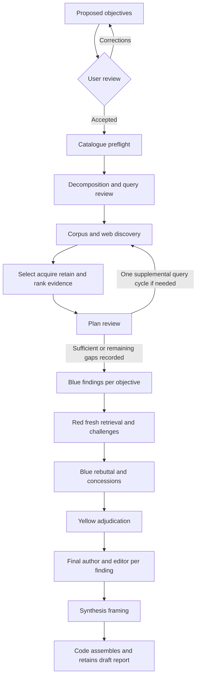

# Scripted Aletheia research

`deep_research` now runs an executable JavaScript workflow. The script decides
which task runs next, validates its output and assembles a detailed report with a
section for every research objective. A bounded `research_analyst` provides
analytical judgments; it has no tools and cannot control the workflow.

Implementation: [deep_research.js](../plowshare-server/src/main/resources/orchestrations/deep_research.js).
Authoring/runtime reference: [JavaScript orchestration guide](scripted-orchestrations.md).

This page describes how to call the shipped script, follow its state machine,
inspect its source/report records and adapt its analytical tasks. It is also the
usage contract for another agent invoking `deep_research`.

## Starting and reviewing research

Start deterministically through the CLI without a bot deciding to invoke the tool:

```sh
bin/plowshare-cli orchestration start '{"agent":"farnsworth","definition":"deep_research","request":"Compare adoption and efficacy; retain contrary evidence","requestId":"00000000-0000-0000-0000-000000000001"}' --project repo --json
bin/plowshare-cli orchestration wait orc_RETURNED_ID --json --timeout-ms 300000
```

Use a fresh stable UUID per intended run. A lost response is recovered with
`orchestration receipt UUID`; do not start another paid run to discover whether the
first committed. Caller grants, account/project authorization and normal hooks
apply. Any authorized user-defined definition uses the same start command. See the
[CLI contract](../plowshare-cli/README.md) for offline discovery and structured recovery.

Ask a bot granted `deep_research` for a research report, or use its `/research`
trigger. Farnsworth and Aristoxenus already carry that grant. The bot's existing
`orchestrate_deep_research` tool accepts the research request and context. Project
runs use the caller's project and account; global runs use personal/shared policy.
The script cannot select another account or project through document arguments.

Existing WebSocket conversation, orchestration status, record, stage, answer and
cancellation controls apply. There is no new REST API. Generic `orchestration.start` and receipt lookup use the
authenticated WebSocket and existing orchestration service. A completed run returns the retained report revision and its text.
Find the report in the information library to inspect evidence and processing
status. It is a **draft**; finalisation is a separate owner action after processing
and publication gates have passed.

For an immutable feedback revision, pass this JSON text as the tool's research
`request`, replacing the revision with an accessible retained report UUID:

```json
{
  "question": "How effective is the intervention, and what explains adoption?",
  "feedback_revision": "00000000-0000-0000-0000-000000000000",
  "feedback": "Investigate contradictory outcomes and separate controlled trials from observational evidence."
}
```

The prior report is read as an assessment, then research is rerun. The new draft
uses the same report resource/name and a new immutable revision. Consuming the
previous report also inherits its input restrictions. Feedback is not evidence.

## Instructions for calling agents

Call the offered `orchestrate_deep_research` tool with this **tool argument object**:

```json
{
  "request": "How effective is the intervention, and what explains adoption?",
  "context": "Focus on controlled trials and adoption in Australia since 2020. Identify contradictory results and gaps.",
  "wait": true
}
```

`request` is required text; `context` is optional text. State the substantive
question and constraints clearly. The question is bounded to 8,000 JavaScript
UTF-16 code units. The script derives objectives, presents their intent, entities,
themes and expected evidence through `orchestration_ask`, and waits for the user
to accept them before catalogue reads or searches. Corrections produce a revised
proposal for another review. There is no caller-supplied objective list. A caller cannot
choose document ownership or broaden project permissions in this payload.

The start tool returns the public run handle immediately. `wait: true` is the
default and ends the caller's turn until the run reports. With `wait: false`, the
caller can continue other work. Checking your own still-working run with
`orchestration_status` also ends your turn until it reports; avoid a polling loop.
Use the actual offered schemas for follow-up controls:

```json
{"id":"orc_…"}
```

That is the argument shape for `orchestration_status` and
`orchestration_cancel`. Agent cancellation is limited to an asking/waiting run;
the person can cancel an actively running run through the existing client control.
To answer an outstanding question, use `orchestration_answer` with `id`, `answer`
and any required structured `choices` shown by the question. Resolve a hook failure
before answering it. An answer does not bypass a gate.

For feedback, `request` must remain a **string containing JSON**, not an object:

```javascript
const argumentsForTool = {
  request: JSON.stringify({
    question: 'How effective is the intervention, and what explains adoption?',
    feedback_revision: priorAccessibleReportRevision,
    feedback: 'Investigate contradictory outcomes and separate trial designs.'
  }),
  context: 'Preserve the original geographic scope.',
  wait: true
};
```

This constructs tool arguments; it is not code to execute inside the research
worker. `feedback_revision` is an accessible report revision UUID, not a run handle,
resource UUID, evidence UUID or URL. The script checks its report kind, reads it in
32,768-unit pages and stops above 131,072 units of prior-report text. The finished
result includes the new retained draft revision and explicit paged `information_read` arguments. The full report is retained once, rather than duplicated into the caller conversation. Finalisation and
sharing belong to the owner's existing information controls.

Treat `holds` as a recorded adjudication, not a guarantee of truth. If a run fails,
inspect status, the record and relevant tickets before starting another paid run.
Do not cite search snippets or assume a retained source was used in the report.

## What the pipeline ports

Compared against the local Aletheia checkout `851668f` in `llm-mcp-project`:

| Aletheia behaviour | Plowshare implementation |
| --- | --- |
| Question analysis and objectives | Preserve original question; derive one to five objectives, intent, entity anchors, scope and expected evidence. |
| Objective review | Present the proposed objectives to the user; accept explicit approval or revise from corrections before research. |
| Decomposition and query review | Aim for 12–24 queries per objective, approximately twenty; accept additional useful queries; cover entity, topic, terminology and adversarial angles; review every query and record retained category coverage as guidance. |
| Catalogue and retrieval | Scoped catalogue preflight, semantic corpus retrieval and web discovery; retain discovery frequency as a signal rather than corroboration. |
| Original-intent ranking | Select sources and rank retained passages against the original question and objectives; supply passages in descending relevance. |
| Source acquisition | Enqueue selected URL acquisitions before reading; retain immutable source revisions and exact UTF-16 evidence windows. Snippets remain discovery metadata. |
| Plan critique | Refine accepted topics using retrieved evidence; if coverage is insufficient, run one targeted supplemental retrieval/ranking cycle before Blue. |
| Blue analysis | Produce concise research points per objective with separate reasoning and evidence references. |
| Red retrieval and analysis | Aim for eight to fifteen fresh counter-queries, accept additional useful queries and shorter valid sets; perform a second retrieval/acquisition/ranking wave when queries exist and challenge every finding. |
| Blue rebuttal and Yellow adjudication | Explicitly defend or concede challenges; adjudicate every finding as holds, weakened, refuted or not_checked. |
| Yellow expansion and synthesis | Expand each adjudicated point into analytical prose, review it against evidence and its verdict, then preserve the edited prose in code-assembled objective sections. |
| Report feedback/revision | Rerun with feedback and retain an immutable revision of the same report resource. |

Aletheia's current dispatch skips its deprecated Blue expansion and expands only
after Yellow adjudication. Plowshare follows that sequence: brief claims first,
then evidence-bounded analytical paragraphs. Aletheia requests 2–4 paragraphs
without a word-count validator; Plowshare also treats paragraph count as guidance.
An incomplete expansion is recorded locally rather than stopping the research
run or silently approving the prose.

The workflow follows Aletheia's objective review, query planning and evidence-driven
plan critique. Its ranking implementation differs: Aletheia defaults to 70%
objective embedding similarity plus 30% normalized cross-query frequency; this
script uses worker-assessed relevance scores and sorts retained passages by their
highest objective score. Rankings are advisory: unscored passages retain a null
relevance and `ranking_status: not_checked`, remain available to downstream reviewers,
and sort after scored passages. A zero score means an actual low-relevance assessment;
it is not substituted for a missing score. It does not implement that embedding formula. Entity
enrichment, scheduling and delta monitoring remain outside this port. Plowshare
keeps its existing PostgreSQL/pgvector projections; Solr, Neo4j

## Catalogue retention and the fetch audit

Every source admitted by URL acquisition becomes a document revision in the
existing scoped catalogue before citation decisions are made. Research does not
remove or exclude it when it is unused. Reports cite exact retained evidence
windows, so a reference can be resolved to its catalogue revision and original
bytes after the producing run finishes.

The cited-source bibliography lists references actually used in the analytical
text and finding support/counter-evidence. Merely fetching or inspecting a source
does not manufacture a citation. A separate **Fetch and document audit** appendix
covers every selected source from both retrieval waves, including existing
catalogue documents reused without a fetch, successfully acquired uncited documents,
extraction failures and failed acquisition tickets. It records requested/final URL,
wave, selection rationale, ticket, retained revision, observed attempt/error,
extraction/inspection state, evidence coordinates and citation-use flags.

The distinction is per document and per evidence window: an unused window of a
cited document is not an uncited document. All consumed retained revisions remain
restrictive report inputs, including uncited ones. Their later withdrawal still
restricts the report. Retention remains subject to explicit owner lifecycle actions
and current project/account permissions.

Search hits rejected before acquisition were discovered, not fetched; their metadata
and selection decisions remain in the command journal. Failed fetches have durable
tickets and recorded outcomes rather than invented document bodies. The report
appendix is an immutable snapshot; ticket status remains the current record for a
later explicit retry. Interrupted runs retain receipts/tickets even without a final
report. The existing WebSocket catalogue, acquisition and report operations provide
inspection; no separate catalogue or REST interface is added.

## Script contract and recovery

The script is a marked ECMAScript module exporting `manifest` and synchronous
`step(input)`. It returns JSON state and one granted command per fresh sandbox
invocation. The [JavaScript orchestration guide](scripted-orchestrations.md) gives
the exact manifest, input/output contract, limits, installation tiers and complete
[runnable example](examples/scripted-orchestrations/catalogue_inventory.js).

Research uses the durable V84 command journal: intent/state precede execution,
effective pre-hook arguments precede the call, raw output precedes post hooks and
judged output precedes advancement. Completed commands are consumed without
reissuing them. A completed delegate answer can be recovered from its child log;
a started effect without a durable result refuses automatic replay.

The 12–24 query count is guidance, not an acceptance limit. Larger valid sets
proceed through query review and retrieval without a correction call. Existing
command and model-call budgets bound execution. Review can drop irrelevant or
redundant queries. Four-category coverage, eight queries and three adversarial
queries per objective are advisory: complementary objectives can supply different
angles. Missing categories and counts are retained in coverage metadata for the
evidence-driven plan critique. Globally missing categories and objectives with no
retained queries are disclosed in the report. An entirely empty or rejected query
plan stops clearly before research instead of overriding the reviewer.

Malformed decomposition output uses the same bounded structural repair as other
analytical responses, described below. Query structure, known category values and
anchor filtering still apply; category balance and minimum counts do not abort a
run. Script evaluation failures report the specific error and completed
command/model-call counts while paid command results remain in the journal.
Non-JSON service results identify their tool and operation and include the original
error (up to 4,096 characters; the journal retains it in full). They are not sent
to the analytical JSON repair worker or described as malformed user approval.

Tool and orchestration stage hooks follow the harness → project → pinned owner
chain. Pre denial, withheld tool results and atomic orchestration-stage refusal
pause through the normal question path; resolve the gate and then answer to recheck
it. Cached paid output cannot be reused if effective arguments change. A blocked
information acquisition/extraction is instead inspected through its durable
information ticket/status and explicit lifecycle retry controls.

Root permissions and consumed-source restrictions apply to descendants, logs,
state and reports. Deleting a consumed source clears related script journal
material. The script cannot select another account/project or share/finalise a report.

## Research state machine

The manifest seeds fifteen ordered stage todos. Each stage enters through
`todo_write` to `in_progress`, runs its commands, then exits through `todo_write`
to `done`. `accept()` checks the actual todo status before advancing. Stage pre/post
hooks surround the real work; they are not just labels printed in a report.



| Stage ID | Work and completion condition |
| --- | --- |
| `objectives` | Optionally read feedback, then derive 1–5 substantive objectives, concrete shared topic anchors and scope. Exclude report-formatting tasks. Code assigns stable `o1`, `o2` IDs. |
| `objective_review` | Show the proposed scope, objectives, intent, entity anchors, theme and expected evidence. Pause with a native structured question. Explicit acceptance retains the accepted plan; corrections revise the proposal and ask again. No research runs before acceptance. |
| `preflight` | Rank up to 10 scoped catalogue documents against the original question, then list up to 100 catalogue entries. These are discovery context, not evidence quotes. |
| `decomposition` | One worker task per objective generates 12–24 queries, sub-questions, expected evidence and rationale. Code filters non-adversarial queries against that objective's entity anchors and assigns `q1`, `q2` IDs. |
| `query_review` | Review every query as `KEEP` or `DROP`, with a rationale. Category mix and minimum counts are advisory; complementary objectives may retain different angles. Save overall/per-objective coverage and supplied gaps for plan critique. At least one usable query across the full plan is required. |
| `retrieval` | For every kept query, issue scoped corpus search and web discovery search, each limited to 3 hits. Append the first shared topic anchor when no subject alias appears, so abstract queries retain the research subject. Merge candidates and objective membership; retain discovery frequency. |
| `evidence` | Select up to 24 sources from up to 80 candidates balanced across objectives before applying the context bound. Enqueue selected URL tickets before reading, await acquisition/extraction, record up to three distinct exact passages per selected source and rank every window against original intent. If acquisitions fail or any objective has fewer than two retained revisions, allow one supplemental selection from untried candidates. This is a recovery trigger, not a claim of adequate coverage. At least one retained window is required. |
| `plan_review` | An adversarial reviewer checks whether evidence reveals missed entities, relationships, constraints or gaps. It may refine each accepted objective while retaining its ID and substantive topic. Fresh targeted queries trigger one supplemental retrieval, acquisition and ranking cycle, followed by another critique. Persist unresolved gaps before Blue when that cycle is exhausted. |
| `blue` | One task per objective aims for 1–5 distinct single-sentence research points (additional substantive points are accepted), separate reasoning and coverage assessment. An unsupported objective should produce one gap point. Code assigns stable `f1`, `f2` IDs and checks supplied evidence IDs. |
| `red` | Aim for 8–15 counter-queries (shorter valid sets and additional useful queries are accepted), distinct from retained initial queries and each other after case/whitespace normalization. Repeat retrieval, selection, acquisition and ranking as wave 1, then challenge every finding. Wave 1 may find no new retained windows. With zero counter-queries, skip its retrieval and disclose that no independent counter-query search ran. |
| `rebuttal` | Respond to every finding's challenge, explicitly defending or conceding it with retained evidence references. |
| `yellow` | Adjudicate every finding as `holds`, `weakened`, `refuted` or `not_checked`; replace its claim/rationale/support/counter-evidence with the adjudicated values. `holds` requires nonempty support. |
| `final_expansion` | For each adjudicated finding, an author develops evidence-bounded analytical prose and an editor checks reasoning, citation entailment and consistency with the verdict. Aim for 2–4 substantive paragraphs; counts and length are guidance, with no minimum-word gate. Incomplete expansion is disclosed as `NOT_CHECKED` without changing adjudication or aborting other findings. |
| `synthesis` | Write executive summary, methodology, limitations, open questions and conclusion. It does not replace the per-finding objective sections. |
| `report` | Assemble all objective sections in code, validate citation IDs, append cited-source provenance and the selected-source audit, then record a draft. Confirm the returned revision UUID before marking the stage done. |

After the last stage is confirmed done, emit `orchestration_finish`. The `red`
stage contains several subphases; one stage does not imply one command or model call.

## Persisted state and source helpers

Every command returns the entire next JSON state. On the next invocation,
`accept(state, input)` consumes the result associated with `state.pending`, then
`step` chooses the next command. No module-local mutable value persists.

| State fields | Meaning |
| --- | --- |
| `question`, `context`, `scope`, `topicAnchors` | Original question/background and explicit derived scope. |
| `feedbackRevision`, `feedback`, `feedbackOffset`, `feedbackLoaded`, `previousReport`, `reportName` | Bounded feedback read and same-resource report naming. |
| `stage`, `entered`, `cursor`, `subphase`, `pending`, `queryPart`, `sourceFence` | Stage index and exact continuation. `cursor` is reused for the active list, not a global progress percentage. |
| `objectives`, `originalPlan`, `acceptedPlan`, `objectiveApproved`, `objectiveFeedback`, `objectiveReviewNote` | Current objectives, initial proposal, user-accepted plan and the pending objective decision/corrections. Reviews retain the delivered answer and author. |
| `decompositions`, `queries`, `discardedQueries`, `queryReview`, `queryCoverage`, `supplementalQueries`, `critiqueIteration`, `counterQueries` | Query plans, retained/dropped decisions, one supplemental plan-critique cycle and fresh challenge queries. |
| `catalogue`, `candidates` | Catalogue metadata and discovered sources. Rejected candidates remain journaled, even when no fetch occurred. |
| `selected` | Current selection's choices, ticket/readiness fields, pending passage windows and stable `auditIndex`. Replaced for supplemental selection or the next wave. `selectionRounds` bounds selection to two batches per retrieval cycle; the plan critique may open one additional cycle in wave 0. |
| `fetchAudit` | Selected-source records spanning both waves; survives replacement of `selected`. |
| `sources` | Sources with successfully recorded exact evidence, including quote/coordinates/evidence UUID/wave. Failed acquisitions are in the audit, not invented evidence. |
| `ranking`, `coverage`, `plan`, `scopeChanges` | Original-intent rankings, objective coverage and scope/gap observations. |
| `findings`, `expansion`, `red`, `rebuttal`, `yellow` | Findings and assessments. `expansion` is the current author result awaiting the editor. |
| `reviews`, `failures` | Recorded assessments/editor verdicts and disclosed retrieval/coverage problems. |
| `synthesis`, `reportText`, `citedEvidence`, `report` | Framing sections, assembled Markdown, actually referenced evidence IDs and report admission receipt. |

| Function | Responsibility |
| --- | --- |
| `command`, `model` | Save the continuation and emit one host command. `model` wraps one task for `research_analyst`. |
| `accept` | Decode/validate the previous result and update durable state. |
| `collect`, `mergeDoc`, `mergePassages`, `mergeSearch` | Scoped corpus/web discovery and candidate merging. |
| `validateQueries`, `queryCoverage` | Validate query content, known types and entity anchors; record category/count coverage without fatal quality quotas. |
| `choose`, `enqueue`, `retain` | Original-intent selection, batch ticket enqueue, extraction readiness, exact-window evidence and ranking. |
| `pool`, `evidenceIds`, `ids`, `perFinding` | Supply retained evidence, normalize reference formatting, reject unknown references locally and mark missing/invalid finding reviews not checked. |
| `auditSource` | Update by saved audit index; JSON does not preserve shared object identity. |
| `expand`, `paragraphs`, `validateProse`, `unavailableExpansion` | Expand each adjudicated point, validate inline evidence identities and localize incomplete author/editor output. |
| `objectiveLabel`, `assemble`, `reportReviews` | Consistent persisted objective labels, complete sections, citation allowlist, separate audit revision and bounded report review previews. |

## Analytical worker response shapes

The task strings in `step`, `choose`, `retain` and `expand` are the authoritative
prompts. Responses must be raw JSON objects without fences or extra prose. Malformed
JSON and structural errors receive only the bounded repair described below; invalid
references and semantic validation failures stop the workflow. The original paid
response and validation error remain retained for inspection.

| Task | Expected top-level shape and key constraints |
| --- | --- |
| Objectives / objective revision | `{topic_anchors,objectives:[{objective,intent,anchors,theme?,expected_evidence}],scope}`; aim for 1–5 objectives. Additional substantive topics/anchors are accepted. Missing auxiliary fields are labeled unspecified before human review. |
| Decomposition | `{rationale,sub_questions,queries:[{query,type,sub_question,expected_evidence}]}`; types are `ENTITY_CENTRIC`, `TOPIC_CENTRIC`, `TERMINOLOGICAL`, `ADVERSARIAL`. |
| Query review | `{queries:[{id,decision,rationale}]}`; apply valid `KEEP`/`DROP` rows once by known ID; missing reviews retain generated queries as not checked. An explicit all-DROP review stops before research. |
| Source selection | `{sources:[{key,objectives,rationale}]}`; key identifies a discovered candidate by passage key, revision UUID or URL. Repeated keys merge coverage/rationales and inspected keys reuse evidence. Unmatched keys are omitted and disclosed; no unlisted source is fetched. Whitespace and malformed/missing selection labels recover from discovery metadata. If all keys are unmatched, inspect discovered candidates in the same balanced order used for ranking. Acquire up to 24 unique fresh candidates per batch, deferring excess rather than aborting. Distinct passage keys and repeated citations remain valid. |
| Evidence ranking | `{ranking:[{evidence,objective,score,rationale}]}`; aim to cover every current-wave passage. Accept known current-wave evidence/plan IDs with finite scores in 0–1, including numeric strings. Omit invalid rows with diagnostics; collapse duplicate evidence/objective pairs. Preserve prior valid scores during supplemental ranking unless replaced by a new valid row. Missing/empty rankings leave passages `not_checked` with null relevance and explicit report warnings; after bounded JSON repair is exhausted, continue with prior scores and unranked evidence. No scores or source references are invented. |
| Plan critique | `{assessment,revised_objectives?,needs_supplemental_retrieval,supplemental_queries,scope_changes,gaps}`; partial refinements are accepted and unchanged topics are retained; queries name a known objective, one of the four query types, sub-question and expected evidence. Queries are deduplicated against earlier searches. |
| Blue | `{findings:[{claim,rationale,confidence,support}],coverage}`; keep valid findings for the current objective and known evidence IDs; 1–5 is prompt guidance. Invalid claims/citations are omitted locally; absent findings/coverage become explicit gaps. Confidence labels are requested, not calibrated probabilities. |
| Author | `{paragraphs,rationale}`; nonempty prose bounded to 32,768 UTF-16 units in total. Aim for 2–4 analytical paragraphs; shorter supported text is accepted. |
| Editor | `{verdict,issues,paragraphs}`; explicit `APPROVED`, `REVISED` or `REJECTED`. Approval uses saved author prose. Revision/rejection requires nonempty replacement prose; no minimum word count. Missing verdicts or unusable replacement prose exhaust bounded structural repair, then become disclosed `NOT_CHECKED` expansion gaps. |
| Counter-queries | `{queries:[{query,objective,target}]}`; fresh queries with known objective IDs; 8–15 is guidance, and smaller sets are accepted. Zero queries are disclosed and skip counter-retrieval. |
| Red | `{findings:[{finding_id,challenge,counterEvidence}]}`; match valid rows by known ID, collapse duplicates and mark missing/invalid reviews not checked. |
| Rebuttal | `{findings:[{finding_id,response,support}]}`; match valid rows by known ID, collapse duplicates and mark missing/invalid reviews not checked. |
| Yellow | `{findings:[{finding_id,verdict,claim,rationale,support,counterEvidence}]}`; match valid rows by known ID, normalize verdict label casing and mark missing/invalid adjudications not checked while retaining the original claim. A holds verdict requires support and completed Red/Rebuttal reviews. |
| Synthesis | `{executive_summary,methodology,limitations,open_questions,conclusion}`; preserve supplied bounded text sections with known citations; missing or invalid sections become explicit absence statements. |

Not every prompt field is mechanically enforced. Code normalizes metadata and
checks references, query freshness and prose context bounds. Missing review is
recorded as not checked, and invalid model entries are rejected locally.
Semantic entailment, source independence, depth, confidence and adverse
meaning in prose rely on the analytical/editorial tasks. Code retains adverse
verdict headers and checks citation identity; it cannot prove a paragraph true
merely because its evidence UUID exists.

## Information command reference

These are internal script `command.arguments` examples. Scope/account/project are
bound by the root. Substitute actual accessible IDs for the example variables.
Client WebSocket payloads have their own explicit scope contract, documented in
the [information guide](information-system.md).

| Tool | Argument example | Success result fields used by research |
| --- | --- | --- |
| `information_read` | `{operation:'rank',query:question,limit:10}` | `documents[].document.id` revision UUID and title/source name. |
| `information_read` | `{operation:'list',offset:0,limit:100}` | Catalogue array with `id`, `source_name`/`title` and kind/status metadata. |
| `information_read` | `{operation:'search',query:query,limit:3}` | Passages with `revision`, `matched`, title/distance and, when matched, `text`, `start`, `end`. |
| `search` | `{query:query,page_size:3,max:3}` | JSON page `hits[]` with URL/title/snippet, or a refusal. Discovery only. |
| `information_write` | `{operation:'acquire',url:sourceUrl,name:title,requestId:input.requestId}` | Ticket `id` and current `state`; not a ready body. |
| `information_read` | `{operation:'acquisition',acquisition:ticketId}` | `state`, `revision_id` on success, observed `attempt`/`error`. Success state is `succeeded`. |
| `information_read` | `{operation:'await',sources:[{revision:revisionId},{acquisition:ticketId}],waitMs:30000}` | Readiness fence counts and one current outcome per unique reference. Incomplete waits stay pending. |
| `information_read` | `{operation:'status',revision:revisionId}` | `generation`, `source_uri`, `steps[]`; check the current generation's `extract` stage. |
| `information_read` | `{operation:'search',query:question,revision:revisionId,limit:3}` | Exact source windows within one revision when an indexed passage can be located. |
| `information_read` | `{operation:'read',revision:revisionId,offset:0,limit:4000}` | `{revision,start,end,total,text}` for a leading-window fallback. |
| `information_write` | `{operation:'evidence',revision:revisionId,start:window.start,end:window.end,quote:window.text,locator:'extracted-text:utf16',requestId:input.requestId}` | `{evidence: evidenceUuid}`. Exact immutable extracted substring required. |

Evidence offsets are zero-based UTF-16 code units with exclusive `end`, matching
JavaScript string indexing. Preserve whitespace and Unicode exactly. Do not trim
quotes, derive coordinates from snippets or reinterpret offsets as UTF-8 bytes.
`matched:false` discloses an inability to locate an exact passage. The script tries
a per-revision search and retains up to three distinct exact matches, then records
a bounded leading 4,000-unit source window when
necessary and discloses it.

Selected URLs are queued before reading. The conductor then calls the native
`information_read` operation `await` with the complete selected set of revision or
acquisition references. The readiness fence deduplicates references and returns
`expected`, `settled`, `ready`, `pending`, `complete` and identity-bound `outcomes`.
It releases only when every reference has a durable outcome: readable current-
generation extraction, failed/blocked/cancelled/skipped processing, or an unavailable
source. A successful fetch ticket is still pending until its revision is readable.
Summary and embedding readiness are not required to inspect exact source text.

Each native observation waits up to 30 seconds; an incomplete response keeps the
fence pending and the same references are observed again. Expiry of an observation
is not a document failure or a reason to skip it. Selected references and progress
snapshots survive in the command journal. A readiness observation interrupted before
its receipt can safely resume; acquisition, processing and model calls are not
repeated. General command caps still apply and retain the journal for continuation.
Terminal source problems become audited local gaps and the other readable sources
continue. A blocked source remains unreadable; no hook or authorization is bypassed.
Conductor tool-hook refusals retain their existing pause/refusal behavior.

Information successes are JSON, but permission/argument refusals may be prose.
The decoder stops instead of interpreting a refusal as no results. Retrieval
compatibility, processing allowance and URL intake policy remain service-owned.

Report admission uses this shape after all analytical stages pass:

```javascript
{
  operation: 'report', requestId: input.requestId,
  name: reportName, text: assembledMarkdown,
  inputs: retainedRevisionIds,
  citations: actuallyReferencedEvidenceIds,
  objectives: ['o1: Adoption'],
  findings: [{
    id: 'f1', objective: 'o1: Adoption', claim: adjudicatedClaim,
    rationale: adjudicationRationale, verdict: 'weakened',
    support: supportingEvidenceIds, counterEvidence: contraryEvidenceIds
  }],
  reviews: [{stage: 'yellow', outcome: 'adjudicated', text: serializedReview}],
  scopeChanges: scopeObservations
  // Optional feedback: priorReportRevisionUuid
}
```

Persisted `finding.objective` must exactly match a string in `objectives`; internal
`o1` alone does not match exported `o1: Adoption`. `objectiveLabel` supplies both.
`inputs` are revision UUIDs; `citations`, `support` and `counterEvidence` are evidence
UUIDs. The server adds all consumed inputs, including uncited/preflight documents.
Actual root producer and definition hash are server-derived, not script arguments.

## Reading the report and the audit

The report contains executive summary, question/scope, methodology, every objective
and final expanded finding, limitations, open questions, conclusion, cited-source
provenance and a reference to a separate fetch/document audit. Each finding retains its claim, verdict,
rationale, support, counter-evidence, Red challenge and Blue response. The synthesis
worker provides framing; `assemble` preserves all findings in code.

The analytical body is scanned for `[evidence:UUID]` before adding the bibliography.
Only known referenced IDs enter `citedEvidence`; support/counter-evidence lines
count as references too. An unknown evidence ID stops report assembly. Listing
unused source metadata in the audit does not manufacture references. Assembly then
renders internal handles as numbered citations: public sources link directly to
HTTP(S) URLs, while project documents have numbered bibliography entries. Each
entry shows the source title and retains evidence IDs, immutable revision and exact
passage coordinates. Repeated citations of the same revision/range/text share one
number; separate passages remain distinguishable. Report metadata still uses the
validated evidence UUIDs, independent of presentation numbering.

The audit is a separate information revision named `research-<run>-audit.json`,
with `documents` (the complete fetch audit) and `context_measurements`. Read either
revision with `information_read` using `operation: "read"`, `revision`, `offset: 0`,
and `limit: 8192`; continue from each returned `end` until `total`. Audit storage
uses a separate journalled command and retains all source outcomes and coordinates.
The report keeps all analytical prose and source links, without machine JSON appendices.

Agent `orchestration_status` replies are compact previews with explicit lengths,
truncation indicators and omitted-history counts. For full results from any run,
including older runs, call it with `result_offset: 0` and `result_limit: 8192`, then
continue from `end` until `total`. Result pages enforce the same account/child
access as status. Authenticated WebSocket run inspection and durable history retain
the complete result and message records. Completion deliveries over 8192 UTF-16
characters likewise send a labelled preview and explicit result-page coordinates;
this also protects callers receiving results from older pinned scripts.

| Audit field | Interpretation |
| --- | --- |
| `wave` | 0 initial retrieval, 1 adversarial retrieval; not a source-independence claim. |
| `key`, `title`, `selection_rationale` | Selected identity and original-intent rationale. |
| `requested_url`, `retained_url` | Requested URL and available retained source URI. Corpus reuse may have no requested URL. |
| `acquisition`, `acquisition_ticket`, `attempt`, `error` | Existing-document reuse or observed ticket state/outcome; some fields only exist when observed. |
| `revision`, `extraction`, `inspection` | Retained revision, extraction observation and exact-window inspection status. |
| `evidence`, `start`, `end`, `coverage`, `windows` | Latest retained window plus all successfully recorded windows with exact coordinates and per-window citation use. |
| `evidence_cited` | This exact window occurs in the analytical body/finding references. |
| `document_cited` | Some recorded window from this revision was referenced; can be true while `evidence_cited` is false. |

The appendix is a report-time snapshot; inspect the durable ticket for current
retry status. Unselected search hits remain journaled discovery, not falsely
labelled fetched. Successful uncited documents remain catalogue revisions and
restrictive inputs. Early failures may have no report yet; receipts/tickets still
provide the audit.

## Adapting the research script

Keep control flow in JavaScript and analysis in explicit worker tasks. To add a
review stage, add its manifest stage, state initialization, dispatch case, pending
result kind, validation and report/review handling. Exercise the actual `.js` with
refusal and missing/malformed worker outputs. Change prompts and validators together.

Keep objective/finding IDs stable, preserve question constraints and allow only
retained evidence IDs. Adding a retrieval wave must preserve the shared audit;
object aliases do not survive JSON. Run the actual report-details validator when
changing metadata; a mock accepting every payload misses objective label errors.

Increasing objective/source/finding bounds increases commands, model calls, state,
worker context and report metadata. Defaults are 2,000 commands and 400 model calls,
not a promise that every maximum-size request fits. With `O` objectives and `F`
findings, ordinary analytical tasks total approximately `12 + 2*O + 2*F`, assuming
both source-selection/ranking waves complete, plus at most two supplemental
source-selection calls. A plan-critique retrieval cycle adds source selection,
ranking and a second critique, with at most one recovery selection. User corrections
add objective-revision tasks before any retrieval. Actual spending follows worker/root
rules; information processing captures a separate configured allowance. Poll waits
and retrieval add commands without being analytical model calls.

Document size also affects total work: the document summarisation cascade processes
paragraphs and folds their assessments through sections, chapters and the document.
That processing uses each document's separately captured allowance. The 400-call
research budget covers the shared analytical delegate calls; it is a ceiling, not
an upfront reservation or a single combined limit for every acquired document.
Research currently inspects bounded source windows rather than automatically
expanding its finding count in proportion to a source's full length.

Further enrichment, scheduling and delta monitoring require explicit workflow/state
design. Continue using existing WebSocket controls and
scoped document services; extensions must retain stage hooks and source provenance.

See the complete [runtime reference](scripted-orchestrations.md) for installation,
the step contract, a runnable small example, debugging and recovery boundaries.

## Bounded output repair and context cost

Model responses use the shared Java [LlmJson utility](../plowshare-server/src/main/java/io/aeyer/plowshare/server/llm/LlmJson.java),
exported through Graal as `llmJson.parse(raw)`. The Java `ModelJson` object reader uses
the same utility; the script contains no recovery parser. It first tries strict JSON,
then, for malformed responses up to 32,768 UTF-16 units, combines Aletheia's research,
enrichment and graph recovery: Markdown fence/prefix removal and complete-root extraction,
single quotes, trailing commas/raw controls, missing commas between lines, literal quotes,
lone backslashes and escaped structural quotes. Valid escapes and LaTeX backslashes
are preserved before the broad escape fallback. Multiple roots and non-finite numeric
tokens are refused. Strict input is capped at 524,288 units and nesting at 128. These are
formatting heuristics; the original response is kept and every recovered object still
passes the ordinary stage, evidence-ID and citation validators. No missing fields or
closing brackets are invented, and service responses and request envelopes remain strict.

Local recovery costs no model call. A compact review records the selected pass and
parser errors. `jsonRecovery` holds the latest full diagnostic: command sequence, task,
attempted text and each parser error with line/column/offset. Inputs exceeding the recovery
bound retain a 4,096-unit diagnostic excerpt with original length and a cut flag;
the complete command receipt remains retained. Diagnostics travel in serialized state after successful
recovery or while requesting a model repair; previous copies remain in earlier journal
states rather than accumulating all raw responses in the current context. Raw command
receipts always remain in the journal, including a final unrecoverable response. Failure
messages include the parser's reason; transformations computed during a terminal throw
are not a separately committed state and can be reproduced from the retained receipt.

Malformed JSON or an invalid structural shape may then receive one narrow model repair per
analytical response, with at most three repairs per run. Repairs consume the existing
shared model budget. The script retains the original response and validation error
in serialized state and the command journal. The repair sees the expected schema,
original response, exact validation error and allowed evidence IDs; it is instructed
to preserve judgments, prose, verdicts and references. The target JSON shape is an
explicit output instruction outside the untrusted repair data. The worker must return
the corrected original object itself, not an escaped JSON string or the input wrapper
with `original_response`, `validation_error` and `allowed_evidence` metadata.
Responses above 32,768 units
and ordinary prose refusals are not repair candidates. Meaningless objectives or
decomposition still stop before research. Later assessments become local gaps after
repair exhaustion; completed evidence and findings continue to the report. Missing
reviews are not implicitly approved. Author/editor failures retain their responses/errors,
omit unaccepted expanded prose (including responses without an explicit editorial
verdict), record `NOT_CHECKED`, and continue to the next
finding. The adjudicated claim and verdict remain unchanged; the report discloses
the missing editorial expansion.

Full review
responses remain in the journal; report metadata uses bounded previews and no
arbitrary 100-record ceiling. The overall metadata byte budget still applies.
Unknown references, missing adjudication verdicts, stale counter-queries and
semantic failures remain failures. No retrieval, completed analysis, completed report
or information mutation is automatically rerun to repair model formatting.

Reports include `contextCost`: analytical task count, serialized input characters,
evidence characters and repeatedly supplied evidence characters. These measure task
data rather than provider tokens.

Each analytical call receives a working evidence projection. Exact duplicate text,
including whitespace, appears once across retrieval waves; all evidence ID aliases
and original source locations remain attached. Identical text from multiple documents
is not evidence of independent corroboration. The durable evidence pool, source audit
and citation validity are unchanged.

The default working target is 24 unique passages and 48,000 quotation characters.
Selection balances objectives and different source documents before filling by
relevance. Discovery frequency does not give a passage extra votes. Ranking runs in
batches targeting at most 24 unique passages and 48,000 quotation characters so that
the entire pool can still be assessed without cutting passages;
a score for identical text is applied to its evidence aliases within that wave.
Missing scores remain `not_checked`.

Finding, review and Author citations take priority over these selection targets:
all explicitly referenced supporting and counter-evidence is included, even when it
exceeds a target. Exact quotes are never shortened to meet a character target.
Packets disclose retained, unique, supplied and omitted counts and target overflow;
omitted context is still available in the retained evidence pool, not missing research.

`information_read search` also exposes the existing Anchor paragraph, section,
chapter and document summaries alongside the exact source window. These are labeled
generated navigation context, not verbatim quotations or citable evidence. Research
reuses summaries already available without waiting for their completion or starting
extra model work. Selected passages retain their available summary context; up to
12 omitted passages with summaries may provide broader navigation context. Neither
summaries nor source links substitute for checking whether the quoted passage
supports the claim.

For a real comparison, use the same request and evidence corpus in an isolated project,
record its start/end timestamps, and wait for all selected sources' processing to settle.
Read the existing authenticated ledger through the CLI:

```sh
bin/plowshare-cli usage orchestration '{"orchestration":"orc_RETURNED_ID","scope":"subtree","group_by":["operation"]}' --json
bin/plowshare-cli usage project '{"project":"isolated_research","from":"2026-10-02T00:00:00Z","to":"2026-10-02T01:00:00Z","group_by":["operation"]}' --json
bin/plowshare-cli usage calls '{"project":"isolated_research","from":"2026-10-02T00:00:00Z","to":"2026-10-02T01:00:00Z"}' --json
```

The orchestration subtree measures analytical work; document processing owns separate
conversations, so the isolated project/time-window report measures both without
adding overlapping totals. `group_by: ["operation"]` exposes their components.
Do not use a busy project window as an exact research-run cost. Retain decimal-string
token/cost totals, per-currency amounts, known counters, completeness and health;
unknown usage is not zero. Follow usage cursors with identical filters and timestamps.
Call attempts expose recorded duration milliseconds. Provider token, paid-work latency
and live quality parity remain unmeasured. Bounded parallel execution remains a later
change after that comparison.

## Bounds and verification

The shipped defaults permit 2,000 commands and 400 shared model calls; project/root
limits may be lower. Each retrieval wave selects at most 24 sources per batch,
with at most two batches per retrieval cycle. The initial wave can have one
additional cycle requested by the plan critique; the Red wave has one cycle.
Source selection remains an analytical judgment, not
a guarantee of source quality or coverage. Extracted
passages must match immutable source text exactly. When no indexed passage matches,
the script records a bounded leading-window fallback and states that limitation.
Discovery frequency does not prove source independence or factual correctness.

Workflow fixtures execute the actual script with deterministic model/tool outputs,
including contradictory evidence, adverse adjudication, final author/editor expansion,
concise corrections, local expansion failures, multiple exact passages, supplemental
source selection and research-topic anchoring,
immutable feedback, refusal of invented citations and explicit disclosure of missing
editorial verdicts.
Real PostgreSQL tests exercise command recovery and policy; authenticated WebSocket
integration retains a source-derived report with the actual producer/hash and
refuses it after source withdrawal. These establish execution and provenance.
Live report quality, cost and latency parity with Aletheia remain unmeasured.
